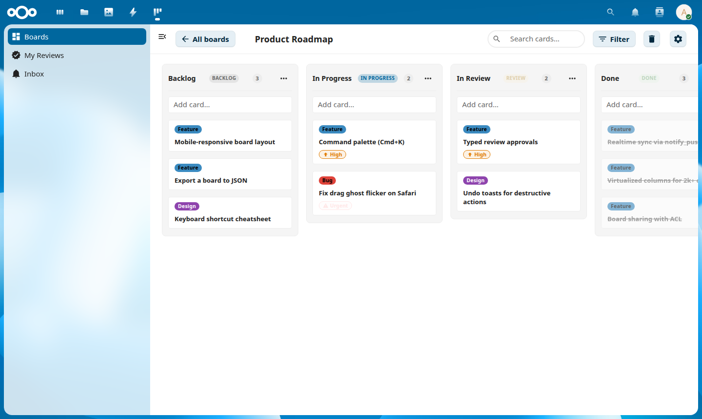
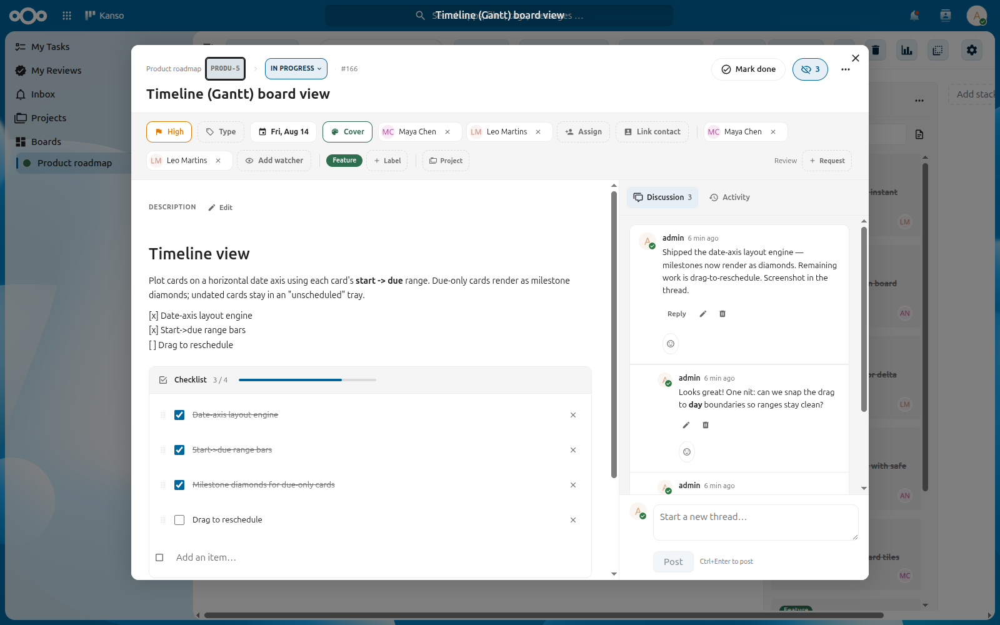
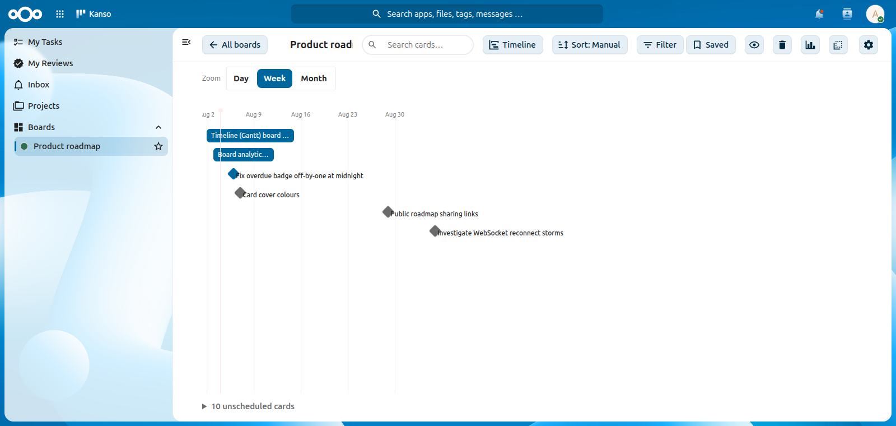
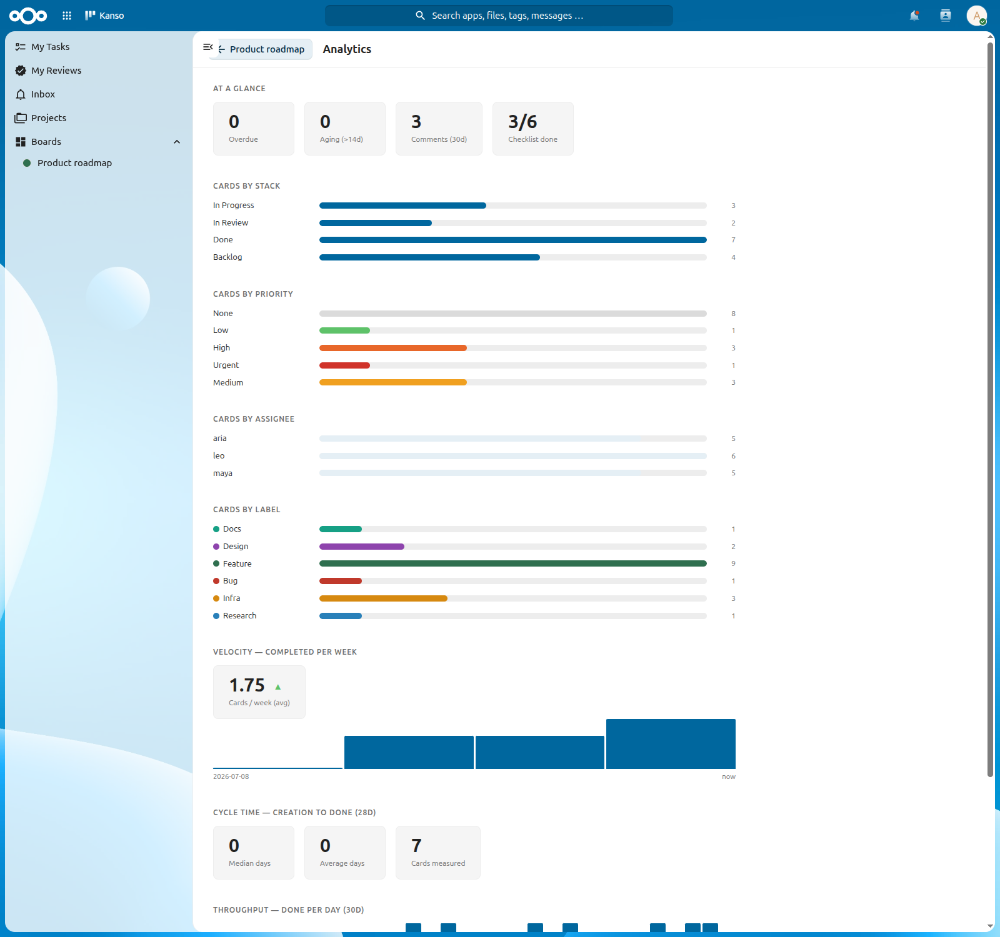

<div align="center">

# Kanso

**Fast, open-source kanban boards for [Nextcloud](https://nextcloud.com).**

[](https://github.com/aktasfatih/kanso/actions/workflows/ci.yml)
[](LICENSE)


Instant drag & drop, payloads sized for large boards, realtime sync: a
from-scratch kanban board that stays out of your way.



</div>

## Why "Kanso"?

**Kanso** (簡素) is one of the seven principles of Japanese Zen aesthetics. It
means *simplicity*: the deliberate elimination of clutter so that only what
matters remains. That is the whole idea behind this app: a kanban board that is
fast, uncluttered, and free. No lock-in, no bloat, no per-seat pricing. Just
your work, on your own Nextcloud, laid out plainly.

## Features

### ⚡ Fast by design
- **Instant, optimistic drag & drop**: a card move is a single-row update
  (fractional sort keys), never a bulk renumber.
- **Built for large boards**: summary-only payloads, `ETag`/`If-None-Match`
  caching, and virtualized columns that stay smooth past **2,000+ cards**.
- **Realtime**: live updates via `notify_push` when available — a board change
  triggers an `ETag`/`If-None-Match` refetch that returns `304 Not Modified`
  when nothing changed — with a light polling fallback everywhere else.

### 🗂️ Rich cards
- Markdown descriptions (sanitized), **labels**, due dates, **assignees**, and
  priorities.
- **Checklists / sub-tasks**, **parent ↔ child cards**, and **threaded
  comments**.



### 👥 Collaboration
- **Board sharing** with per-user and per-group access control.
- **Watchers**: subscribe to cards, comment threads, or a **whole board** and
  get notified of new activity.
- **Parent/child cards**: a parent auto-completes when all its children are done.

### ✅ Review workflow
- Request a review, then **Approve** / **Request changes**.
- An optional **Done-gate**: a card can't leave a review column until every
  requested review is approved.
- **Customizable review types**: QA, Code, Legal, or whatever your team needs.
- A cross-board **My Reviews** view so nothing waiting on you slips through.

### 🔁 Automation & workflows
- **Stack roles** and **WIP limits**; moving a card into an "in progress" column
  auto-**starts** it and a "done" column stamps it **done**. You can also set
  the status (Not started / In progress / Done) directly from the card.
- **Recurring cards** on RRULE schedules, and **auto-archive** rules for done
  cards.

### 🔗 Integrations & migration
- **Import from Deck**: one click copies a Deck board (stacks, cards, labels,
  assignees) into a new Kanso board you own. Your Deck boards are left untouched.
- **Code links**: attach pull requests/issues to a card with live
  open/merged/closed badges, and copy a ready-made `kanso-<id>` branch name.
- **GitHub & Forgejo webhooks**: an HMAC-verified webhook (send it
  `pull_request` and `issues` events, content type `application/json`) moves a
  card to your Review column when its PR opens and to Done when it merges.
  Closing an issue linked on a card moves that card to Done; reopening it moves
  the card back to In progress. Opt-in **issue intake**: pick a column in the
  board's webhook settings and every newly opened issue (optionally filtered to
  one label) becomes a linked card there — title plus issue link only, no body
  copy. No credentials, no OAuth. A board can run both webhooks at once; Gitea
  webhooks work with the Forgejo endpoint. For self-hosted forges Kanso is
  **receive-only** — it never calls your instance, so link badges come from the
  deliveries themselves.
- **MCP server (AI access)**: an optional
  [Model Context Protocol](https://modelcontextprotocol.io) server (under
  [`mcp/`](mcp/README.md)) lets Claude and other MCP clients read and manage
  your boards through Kanso's API — see [MCP server](#mcp-server-ai-access).

### 📊 Views
- **Board, List and Timeline** views: switch per board (remembered per user).
  The list is a dense, scannable table; the **Timeline (Gantt)** plots cards on a
  date axis by **start → due**, with due-only cards as milestones.
- **Display sort**: order cards by priority, due date or title. View-only: your
  manual drag order is always preserved.



### 🧭 Cross-board hub & projects
- **My Work** hub gathers, across every board: **My tasks** (cards assigned to
  you), **Reviews** (waiting on you), and an **Inbox** of mentions and activity
  on cards you watch — filterable to a single board.
- **Projects**: cross-board card collections with markdown descriptions and
  per-project analytics.

### 📈 Analytics
- Per-board (and per-project) stats: **velocity** (cards/points per week with
  trend), **cycle time** (median/average days to done), **throughput** (done
  per day), plus breakdowns by stack, priority, assignee and label, and
  overdue / aging / checklist-progress signals.



### ⌨️ Power-user UX
- **Command palette** (`Ctrl`/`Cmd`+`K`) and full-text **search** across cards
  and comments.
- **Keyboard-first** navigation, **undo toasts** for destructive actions, and a
  **trash** with restore.

### 🌍 Localization
- **Follows your Nextcloud language** automatically. German ships today; more
  languages are welcome — see [docs/TRANSLATING.md](docs/TRANSLATING.md)
  (no code required).

## Installation

Kanso targets **Nextcloud 32–34** and **PHP 8.2–8.3**. It isn't on the Nextcloud
App Store yet — until it is, install the pre-built tarball from
[GitHub Releases](https://github.com/aktasfatih/kanso/releases) (no Node or
Composer needed on your server):

```sh
# 1. Download the tarball from the latest release
curl -fLO https://github.com/aktasfatih/kanso/releases/latest/download/kanso.tar.gz

# 2. Extract into your Nextcloud "custom apps" directory (unpacks as kanso/)
tar -xzf kanso.tar.gz -C /path/to/nextcloud/custom_apps/
chown -R www-data:www-data /path/to/nextcloud/custom_apps/kanso

# 3. Enable the app
cd /path/to/nextcloud
sudo -u www-data php occ app:enable kanso
```

The tarball is not (yet) signed by the App Store, so Nextcloud lists Kanso as
an untested/custom app — that's expected. To upgrade, extract the new tarball
over the old directory and run `occ upgrade`.

Open **Kanso** from the Nextcloud app menu and create your first board.

<details>
<summary><b>Install from source</b> (needs Node 20+, Composer, shell access)</summary>

```sh
# 1. Clone into your Nextcloud "custom apps" directory
cd /path/to/nextcloud/custom_apps
git clone https://github.com/aktasfatih/kanso.git
cd kanso

# 2. Build the frontend and install PHP dependencies
npm ci && npm run build
composer install --no-dev

# 3. Enable the app
cd /path/to/nextcloud
sudo -u www-data php occ app:enable kanso
```

</details>

- **Background jobs** (recurring cards, auto-archive, change-log pruning) run
  through Nextcloud's cron. Make sure [system cron](https://docs.nextcloud.com/server/latest/admin_manual/configuration_server/background_jobs_configuration.html)
  is configured.
- **Realtime updates** use the [High Performance Backend (`notify_push`)](https://github.com/nextcloud/notify_push)
  when it's installed; otherwise Kanso falls back to polling automatically.

### Try it locally (no Nextcloud required)

The repo ships a throwaway Docker dev stack:

```sh
npm install
npm run build
cd dev && ./setup.sh   # boots Nextcloud + Postgres and enables Kanso
```

Then open <http://localhost:8891> (login `admin` / `admin`).

To try another supported Nextcloud version or database (the same knobs CI's
cross-version matrix uses):

```sh
NC_VERSION=32 KANSO_DB=postgres ./setup.sh   # NC 32 on Postgres
NC_VERSION=32 KANSO_DB=sqlite   ./setup.sh   # NC 32 on SQLite (no db container)
NC_VERSION=34 KANSO_DB=mysql    ./setup.sh   # NC 34 on MariaDB
```

The boot also side-loads two optional Nextcloud apps (Deck and Contacts) that a
couple of the end-to-end tests need. They're downloaded from GitHub; if you're
offline, skip them — only those two tests care:

```sh
KANSO_SKIP_OPTIONAL_APPS=1 ./setup.sh
```

## MCP server (AI access)

Kanso ships an optional **[Model Context Protocol](https://modelcontextprotocol.io)
server** (under [`mcp/`](mcp/README.md)) so AI assistants — Claude Code, Claude
Desktop, and any MCP client — can read and manage your boards: list/create
boards, add columns and cards, move cards, set labels and assignees, and pull
the cards assigned to you. It talks to Kanso's REST API using a Nextcloud **app
password**, so there's nothing extra to install on the server.

It authenticates with a revocable Nextcloud **app password** (not your login
password) kept in the **server's** own `.env` or environment — so **no
credentials ever live in your MCP client config**.

**Quickstart (Claude Code)** — needs Python 3.11+ and [`uv`](https://docs.astral.sh/uv/):

```sh
# 1. In Nextcloud: Settings → Security → Create new app password (revocable; not your login password)
# 2. Give it to the server — credentials stay server-side:
cd mcp && cp .env.sample .env       # then edit .env with your host, user and the app password
# 3. Register the server with your client — note: NO credentials here:
claude mcp add kanso -- uv run --directory /path/to/kanso/mcp kanso-mcp
```

For the HTTP-service setup, Claude Desktop config, and the full tool list, see
**[`mcp/README.md`](mcp/README.md)**. The MCP server is a separate artifact — it
is **not** bundled into the installed Nextcloud app.

## Development

The dev stack mounts your checkout as `custom_apps/kanso`, so a rebuild
(`npm run build`) plus a browser reload picks up frontend changes; PHP changes
apply immediately. `docker compose down` in `dev/` resets the instance.

PHP tooling runs via Docker (no host PHP needed):

```sh
docker run --rm -u "$(id -u):$(id -g)" -e COMPOSER_HOME=/tmp/composer \
  -v "$PWD":/app -w /app composer:2 composer install
docker run --rm -u "$(id -u):$(id -g)" -v "$PWD":/app -w /app \
  php:8.2-cli-alpine php vendor/bin/php-cs-fixer fix --dry-run
docker run --rm -u "$(id -u):$(id -g)" -v "$PWD":/app -w /app \
  php:8.2-cli-alpine php vendor/bin/psalm
```

Tests: PHPUnit for the API/services, Playwright for board interactions.

```sh
npm test                                   # Playwright e2e (needs the dev stack up)
docker run --rm -v "$PWD":/app -w /app php:8.2-cli-alpine \
  php vendor/bin/phpunit -c phpunit.xml    # PHP unit tests
```

## Tech

PHP (Nextcloud App Framework, own `kanso_*` tables) · Vue 3 + `@nextcloud/vue` +
Vite · TanStack Query · Pragmatic drag-and-drop · TanStack Virtual · Postgres /
MySQL / SQLite. Kanso is independent. It does **not** depend on Deck and stores
its own data.

## Status & contributing

Actively developed and usable day-to-day, with a broad feature set already
shipped (boards, the cross-board My Work hub, projects, analytics, reviews,
recurring cards, realtime, Import from Deck, and more). Bug reports and pull
requests are welcome. See the [issues](https://github.com/aktasfatih/kanso/issues)
and [CONTRIBUTING.md](CONTRIBUTING.md).

**Before a release**, re-check that this README and `appinfo/info.xml`
(`<summary>` / `<description>`) still match the shipped feature set — verify
against the code, and don't claim anything that isn't actually wired up.

## License

Kanso is free and open source under the [AGPL-3.0-or-later](LICENSE), and always
will be for the community.

### Commercial licensing

The AGPL requires that anyone running a modified version — including over a
network — makes their source available under the AGPL. Some organizations cannot
accept those terms. If you need to use Kanso without AGPL obligations, a separate
commercial license is available. Reach out at **akfatih2@gmail.com**.

Contributions are accepted under a [CLA](CLA.md) that keeps this dual-licensing
possible — see [CONTRIBUTING.md](CONTRIBUTING.md).
